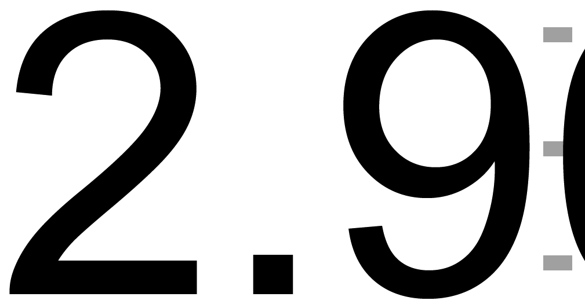
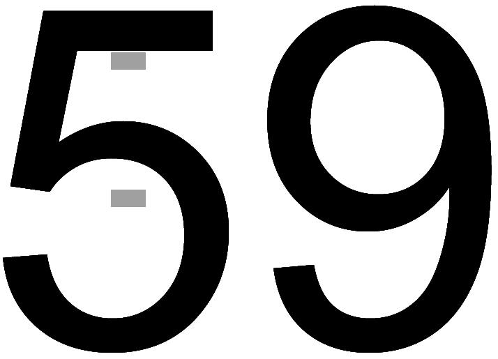

# Graph marker label anti-aliasing inconsistency

*[Thread on Statalist](https://www.statalist.org/forums/forum/general-stata-discussion/general/1656858-graph-marker-label-anti-aliasing-inconsistency)*

The first marker label is anti-aliased, but the others are not.

Any idea why and how to fix this?

* [mwe.do](mwe.do)
* [hist_auto_rep78.pdf](hist_auto_rep78.pdf)

